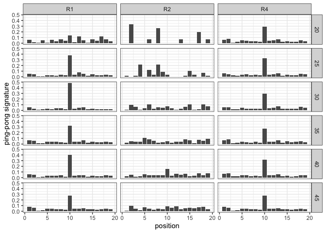
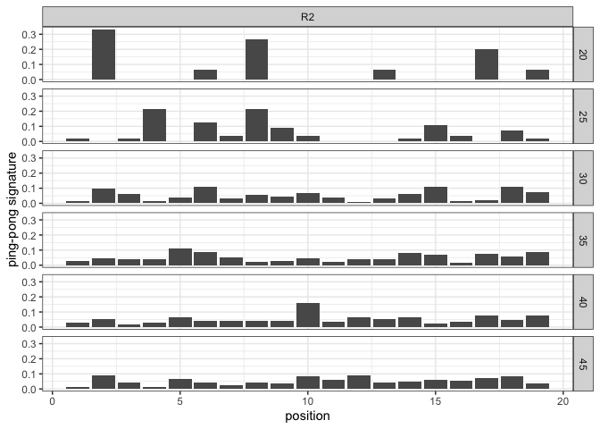
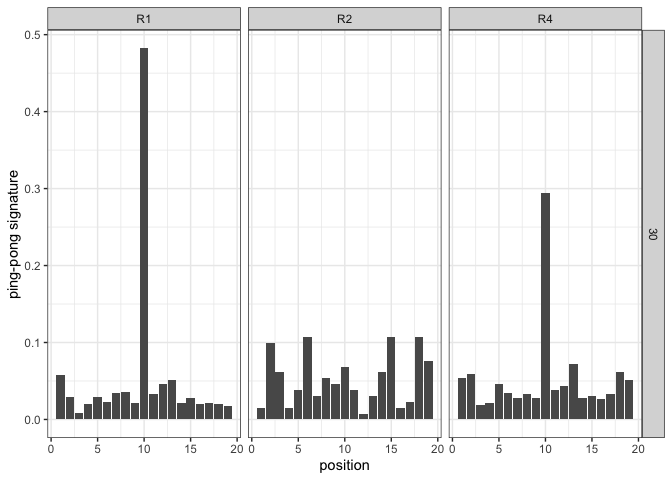
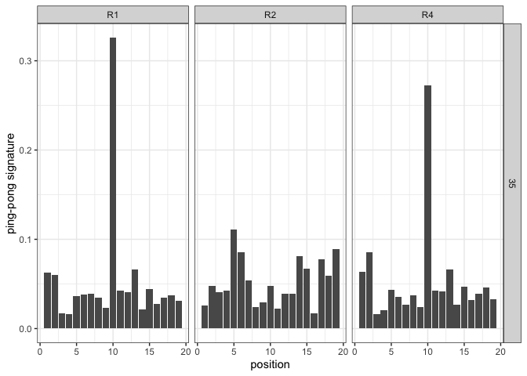

Untitled
================

# Preprocess

``` bash
# script parameters default:
# parser.add_argument("--min-mq", type=int, required=False, dest="minmq", default=1, help="min mapping quality")
#parser.add_argument("--max-mm", type=int, required=False, dest="maxmm", default=2, help="max mismatches")
#parser.add_argument("--sig-len", type=int, required=False, dest="siglen", default=19, help="signature length")
#parser.add_argument("--min-ol", type=int, required=False, dest="minol", default=5, help="minimum number of overlapping ping-pong pairs")
#parser.add_argument("--sample-id", type=str, required=True, dest="sid", default=10, help="the sample id")

source ~/.zshrc 
script="/Users/rokofler/dev/te-tools/ere/ping-pong-signature.py"
mi=23
ma=29
inf="/Users/rokofler/analysis/2021-Dere-Pele/analysis/2021-09-piRNAs/raw-bam"
ouf="/Users/rokofler/analysis/2021-Dere-Pele/analysis/2021-09-piRNAs/07-pingpong/raw"

#--pi-min $mi --pi-max $ma

# Rep 1
samtools view $inf/dere_ovaries_R1G1_trim_clean_sf_sorted.bam | python $script  --sam - --sample-id R1-G1 > $ouf/R1-G1.txt
samtools view $inf/dere_R1G5_trim_clean_sf_sorted.bam | python $script  --sam - --sample-id R1-G5 > $ouf/R1-G5.txt
samtools view $inf/dere_ovaries_R1G10_trim_clean_sf_sorted.bam | python $script  --sam - --sample-id R1-G10 > $ouf/R1-G10.txt
samtools view $inf/dere_R1G15_trim_clean_sf_sorted.bam | python $script  --sam - --sample-id R1-G15 > $ouf/R1-G15.txt
samtools view $inf/dere_R1G20_trim_clean_sf_sorted.bam | python $script  --sam - --sample-id R1-G20 > $ouf/R1-G20.txt
samtools view $inf/dere_R1G25_trim_clean_sf_sorted.bam | python $script  --sam - --sample-id R1-G25 > $ouf/R1-G25.txt
samtools view $inf/dere_R1G30_trim_clean_sf_sorted.bam | python $script  --sam - --sample-id R1-G30 > $ouf/R1-G30.txt
samtools view $inf/dere_ovaries_R1G35_trim_clean_sf_sorted.bam | python $script  --sam - --sample-id R1-G35 > $ouf/R1-G35.txt
samtools view $inf/dere_R1G40_trim_clean_sf_sorted.bam | python $script  --sam - --sample-id R1-G40 > $ouf/R1-G40.txt
samtools view $inf/dere_R4G45_trim_clean_sf_sorted.bam | python $script  --sam - --sample-id R1-G45 > $ouf/R1-G45.txt

# Rep 2
samtools view $inf/dere_ovaries_R2G1_trim_clean_sf_sorted.bam | python $script  --sam - --sample-id R2-G1 > $ouf/R2-G1.txt
samtools view $inf/dere_R2G5_trim_clean_sf_sorted.bam | python $script  --sam - --sample-id R2-G5 > $ouf/R2-G5.txt
samtools view $inf/dere_ovaries_R2G10_trim_clean_sf_sorted.bam | python $script  --sam - --sample-id R2-G10 > $ouf/R2-G10.txt
samtools view $inf/dere_R2G15_trim_clean_sf_sorted.bam | python $script  --sam - --sample-id R2-G15 > $ouf/R2-G15.txt
samtools view $inf/dere_R2G20_trim_clean_sf_sorted.bam | python $script  --sam - --sample-id R2-G20 > $ouf/R2-G20.txt
samtools view $inf/dere_R2G25_trim_clean_sf_sorted.bam | python $script  --sam - --sample-id R2-G25 > $ouf/R2-G25.txt
samtools view $inf/dere_R2G30_trim_clean_sf_sorted.bam | python $script  --sam - --sample-id R2-G30 > $ouf/R2-G30.txt
samtools view $inf/dere_ovaries_R2G35_trim_clean_sf_sorted.bam | python $script  --sam - --sample-id R2-G35 > $ouf/R2-G35.txt
samtools view $inf/dere_R2G40_trim_clean_sf_sorted.bam | python $script  --sam - --sample-id R2-G40 > $ouf/R2-G40.txt
samtools view $inf/dere_R2G45_trim_clean_sf_sorted.bam | python $script  --sam - --sample-id R2-G45 > $ouf/R2-G45.txt

# Rep 4
samtools view $inf/dere_ovaries_R4G1_trim_clean_sf_sorted.bam | python $script  --sam - --sample-id R4-G1 > $ouf/R4-G1.txt
samtools view $inf/dere_R4G5_trim_clean_sf_sorted.bam | python $script  --sam - --sample-id R4-G5 > $ouf/R4-G5.txt
samtools view $inf/dere_ovaries_R4G10_trim_clean_sf_sorted.bam | python $script  --sam - --sample-id R4-G10 > $ouf/R4-G10.txt
samtools view $inf/dere_R4G15_trim_clean_sf_sorted.bam | python $script  --sam - --sample-id R4-G15 > $ouf/R4-G15.txt
samtools view $inf/dere_R4G20_trim_clean_sf_sorted.bam | python $script  --sam - --sample-id R4-G20 > $ouf/R4-G20.txt
samtools view $inf/dere_R4G25_trim_clean_sf_sorted.bam | python $script  --sam - --sample-id R4-G25 > $ouf/R4-G25.txt
samtools view $inf/dere_R4G30_trim_clean_sf_sorted.bam | python $script  --sam - --sample-id R4-G30 > $ouf/R4-G30.txt
samtools view $inf/dere_ovaries_R4G35_trim_clean_sf_sorted.bam | python $script  --sam - --sample-id R4-G35 > $ouf/R4-G35.txt
samtools view $inf/dere_R4G40_trim_clean_sf_sorted.bam | python $script  --sam - --sample-id R4-G40 > $ouf/R4-G40.txt
samtools view $inf/dere_R4G45_trim_clean_sf_sorted.bam | python $script  --sam - --sample-id R4-G45 > $ouf/R4-G45.txt

cat R* |perl -pe 's/-/\t/' |perl -pe 's/G//' > forr.txt     
```

# Visualization supplement

``` r
library(ggplot2)
theme_set(theme_bw())

h<-read.table("/Users/rokofler/analysis/2021-Dere-Pele/analysis/2021-09-piRNAs/07-pingpong/raw/forr.txt")
names(h)<-c("rep","time","fam","strand","pos","pps")
h$time<-as.factor(h$time)
h$rep<-as.factor(h$rep)
h<-subset(h,strand=="s" & fam=="PPI251")
 
g<-ggplot(h,aes(x=pos,y=pps))+geom_bar(stat="identity")+facet_grid(time~rep)+xlab("position")+ylab("ping-pong signature")
plot(g)
```

<!-- -->

``` r
pdf(file="/Users/rokofler/analysis/2021-Dere-Pele/analysis/2021-09-piRNAs/07-pingpong/graphs/ere-pingpong.pdf",width=7,height=7)
 
plot(g)
dev.off()
```

    ## quartz_off_screen 
    ##                 2

## Visualization just replicate 2

``` r
library(ggplot2)
theme_set(theme_bw())

h<-read.table("/Users/rokofler/analysis/2021-Dere-Pele/analysis/2021-09-piRNAs/07-pingpong/raw/forr.txt")
names(h)<-c("rep","time","fam","strand","pos","pps")
h$time<-as.factor(h$time)
h$rep<-as.factor(h$rep)
h<-subset(h,strand=="s" & fam=="PPI251" & rep=="R2")
 
g<-ggplot(h,aes(x=pos,y=pps))+geom_bar(stat="identity")+facet_grid(time~rep)+xlab("position")+ylab("ping-pong signature")
plot(g)
```

<!-- -->

``` r
pdf(file="/Users/rokofler/analysis/2021-Dere-Pele/analysis/2021-09-piRNAs/07-pingpong/graphs/ere-pingpong-r2.pdf",width=2.7,height=10)
 
plot(g)
dev.off()
```

    ## quartz_off_screen 
    ##                 2

# Visualization main 30

``` r
library(ggplot2)
theme_set(theme_bw())

h<-read.table("/Users/rokofler/analysis/2021-Dere-Pele/analysis/2021-09-piRNAs/07-pingpong/raw/forr.txt")
names(h)<-c("rep","time","fam","strand","pos","pps")
h$time<-as.factor(h$time)
h$rep<-as.factor(h$rep)
h<-subset(h,strand=="s" & fam=="PPI251" &time==30)
 
g<-ggplot(h,aes(x=pos,y=pps))+geom_bar(stat="identity")+facet_grid(time~rep)+xlab("position")+ylab("ping-pong signature")
plot(g)
```

<!-- -->

``` r
pdf(file="/Users/rokofler/analysis/2021-Dere-Pele/analysis/2021-09-piRNAs/07-pingpong/graphs/ere-pingpong-main-g30.pdf",width=7,height=2.5)
 
plot(g)
dev.off()
```

    ## quartz_off_screen 
    ##                 2

# Visualization main 35

``` r
library(ggplot2)
theme_set(theme_bw())

h<-read.table("/Users/rokofler/analysis/2021-Dere-Pele/analysis/2021-09-piRNAs/07-pingpong/raw/forr.txt")
names(h)<-c("rep","time","fam","strand","pos","pps")
h$time<-as.factor(h$time)
h$rep<-as.factor(h$rep)
h<-subset(h,strand=="s" & fam=="PPI251" &time==35)
 
g<-ggplot(h,aes(x=pos,y=pps))+geom_bar(stat="identity")+facet_grid(time~rep)+xlab("position")+ylab("ping-pong signature")
plot(g)
```

<!-- -->

``` r
pdf(file="/Users/rokofler/analysis/2021-Dere-Pele/analysis/2021-09-piRNAs/07-pingpong/graphs/ere-pingpong-main-g35.pdf",width=7,height=2.5)
 
plot(g)
dev.off()
```

    ## quartz_off_screen 
    ##                 2

## Z-score

``` r
library(tidyverse)
```

    ## ── Attaching packages ─────────────────────────────────────── tidyverse 1.3.1 ──

    ## ✔ tibble  3.1.7     ✔ dplyr   1.0.9
    ## ✔ tidyr   1.2.0     ✔ stringr 1.4.0
    ## ✔ readr   2.1.2     ✔ forcats 0.5.1
    ## ✔ purrr   0.3.4

    ## ── Conflicts ────────────────────────────────────────── tidyverse_conflicts() ──
    ## ✖ dplyr::filter() masks stats::filter()
    ## ✖ dplyr::lag()    masks stats::lag()

``` r
library(ggplot2)
theme_set(theme_bw())

h<-read.table("/Users/rokofler/analysis/2021-Dere-Pele/analysis/2021-09-piRNAs/07-pingpong/raw/forr.txt")
names(h)<-c("rep","time","fam","strand","pos","pps")
h$time<-as.factor(h$time)
h$rep<-as.factor(h$rep)
h<-subset(h,strand=="s" & fam=="PPI251")

# h excluding 10 
h$key<-paste0(h$time,"_",h$rep)
het<-subset(h,pos!=10)
hin<-subset(h,pos==10)

het<-het %>%group_by(time,rep)%>% dplyr::summarise(mean=mean(pps),sd=sqrt(var(pps)),key=key[1])
```

    ## `summarise()` has grouped output by 'time'. You can override using the
    ## `.groups` argument.

``` r
m<-merge(x=het,y=hin, by = "key")
m$zscore<-(m$pps-m$mean)/m$sd
m$zround<-round(m$zscore,2)
m$ppsround<-round(m$pps,2)
m$prob<-pnorm(m$zscore, mean = 0, sd = 1, lower.tail = FALSE)
m$time<-m$time.x
m$rep<-m$rep.x
```
